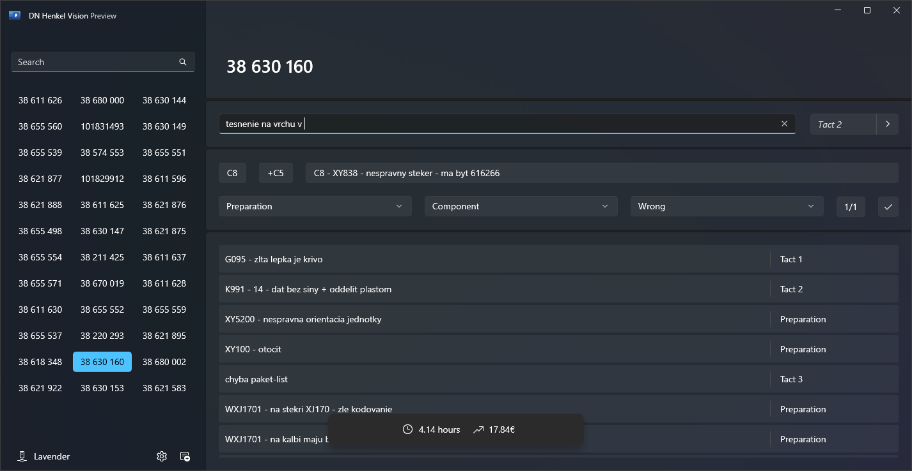
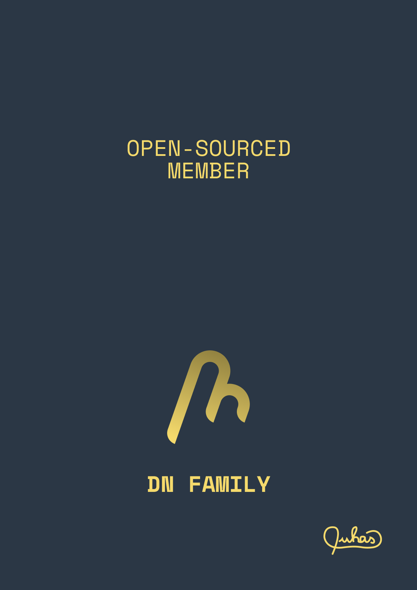

# DN Henkel Vision
   

# Description
DN Henkel Vision is a software application designed for fault registration at [KraussMaffei Technologies, spol. s r.o.](https://www.kraussmaffei.com/en/home) The project is partially funded by the same organization. The application provides support for exporting data to both [Netstal](https://www.netstal.com/#) and [Autrag](https://www.kraussmaffei.com/en/our-products/px-series-250-4-000-kn) Microsoft Access Databases. One of the key features of the application is its integration with `FelberAI`, which predicts the classification of faults.

# Setup Instructions
To set up DN Henkel Vision, follow the standard setup instructions for a WinUI app:

1. **Prerequisites**: Make sure you have the following installed on your machine:
    - [Windows 11](https://www.microsoft.com/software-download/windows11), version 23H2 (build 22631), or later
    - [Visual Studio 2022](https://visualstudio.microsoft.com/vs/), version 17.9.4 or later, with the Universal Windows Platform development workload
    - [The Windows 11 SDK](https://learn.microsoft.com/en-us/windows/apps/windows-app-sdk/), version 23H2 (build 22621), or later

2. **Clone the Repository**: Clone the DN Henkel Vision repository to your local machine.

3. **Open the Solution**: Open the `.sln` file in Visual Studio.

4. **Restore NuGet Packages**: Right-click on the solution in Solution Explorer and select `Restore NuGet Packages`.

5. **Create the Temporary Key**: Right-click on the `DN Henkel Vision` project in Solution Explorer and select `Properties`. Go to the `Package` tab and click on the `Generate Key` button to create a temporary key.

6. **Set the Startup Project**: Set the DN Henkel Vision project as the startup project.

7. **Build and Run the Application**: Press `F5` or use the `Debug > Start Debugging` menu command to build and run the application.

# DN Family Membership
Since January 21, 2024, the DN Henkel Vision project has proudly become an open-sourced member of the DN Family. Prior to this significant milestone, it had been a cherished and copyrighted member of the DN Family since its inception. This transition marks a new era of collaboration and community-driven development for the project.

|  |  |  |
|-------------------------------------|----------------------------------------------|-------------------------------------|